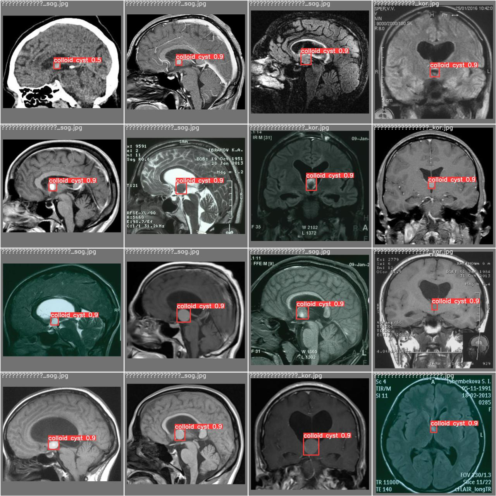

# Colloid Cysts Detection 

## TODO:

- [X] Colloid Cysts Detection

- [ ] Colloid Cysts Segmentation

- [ ] Telegram Bot for Demos

## Detection

For cysts detection we use [YOLOv5 Pytorch](https://github.com/ultralytics/yolov5).

### Dataset 

[Dataset](https://drive.google.com/drive/u/1/folders/10p8fvmVNDhnOUbO3YDSkcO3wrtJThYAj) was collected and marked up at [N. N. Burdenko National Medical Research Center of Neurosurgery](https://www.nsi.ru/). It includes MRI images with sagittal and coronal brain views. 

### Results

| Test images | P | R | mAP@.5 | mAP@.9 |
|---|---|---|---|---|
| 25 | 0.96 | 0.96 | 0.953 | 0.655 |

**Prediction Examples**

